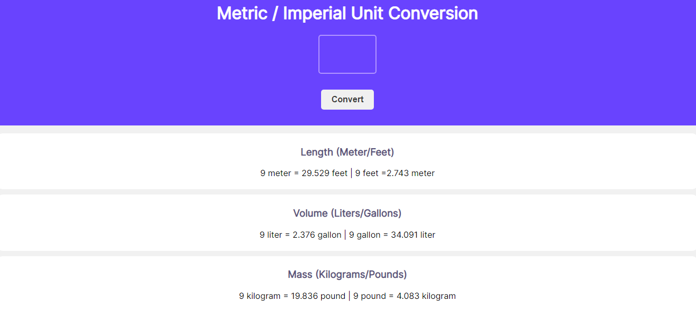

## A simple Units Converter

 Convert Liters to Gallons , Kgs to Pounds etc
     Enter a value and get them all 

You can now find it in your extensions

### Learnt
- `Fixed()` method for Numbers
- `template literals`
----

 
 

